# 真锅大度研究站｜视觉参考候选（Stage 5）

> 检查日期：2026-07-27  
> 任务：从真实艺术家、工作室、媒体艺术机构、数字保存档案、博物馆馆藏、编辑型长文与科学档案中，选定 **1 个主参考 + 2–3 个辅助参考**。  
> 原则：借鉴信息架构、排版节奏和交互行为，不复制品牌视觉。

## 如何选择

- **主参考**决定页面的总体气质、栅格、首页节奏和作品入口方式。
- **辅助参考**只承担明确功能，例如：时间轴、筛选、技术元数据、长文阅读、图像比例或来源透明度。
- 选择回复格式：`主参考 A；辅助 C（技术元数据）、H（筛选）、J（长文阅读）`。

## 一览

| 编号 | 参考 | 类型 | 最适合借鉴 | 中文长文 | 21 件作品规模 | 主要风险 |
|---|---|---|---|---|---|---|
| A | Daito Manabe Selected Works | 艺术家作品中枢 | 暗色工程网格、标签导航、双语入口 | 中—高 | 高 | 科技感过强、栅格线干扰阅读 |
| B | Rhizomatiks Research Works | 工作室作品档案 | 类型标签、沉浸式图像网格 | 中 | 高 | 分类过多、首屏留白偏大 |
| C | Ryoji Ikeda Works Archive | 同领域艺术家档案 | 年代轴、技术参数、图像与数据并置 | 中 | 高 | 字号极小、横向导航不利移动端 |
| D | NTT ICC: MANABE Daito | 机构人物档案 | 人物—作品—展览关系、侧栏目录 | 高 | 高 | 视觉偏传统、品牌情绪较弱 |
| E | Ars Electronica Archive | 媒体艺术总档案 | 搜索优先、档案权威说明 | 高 | 高 | 英雄图占屏、检索规模过重 |
| F | ZKM Collection and Archives | 媒体艺术博物馆 | 模块化入口、大标题与图像配对 | 高 | 中 | 造型语言可能盖过作品 |
| G | Rhizome ArtBase | 网络艺术保存档案 | 保存版本、来源与可访问性说明 | 高 | 高 | 视觉过于工具化、图像吸引力弱 |
| H | M+ Collection Online | 视觉文化馆藏数据库 | 搜索、结果数、筛选、网格/列表切换 | 中 | 高 | 功能复杂度远超当前内容量 |
| I | Tate Discover Art | 博物馆浏览入口 | 图像叙事、主题锚点、浏览层级 | 高 | 中—高 | 容易变成通用博物馆页面 |
| J | Wellcome Collection Stories | 编辑型长篇内容 | 长文导语、内容类型标签、图文分栏 | 很高 | 中 | 不擅长技术元数据与复杂筛选 |
| K | CERN Web Archives | 科学机构档案 | 面包屑、更新时间、来源透明度 | 很高 | 中 | 视觉保守、作品图像承载弱 |

---

## A｜Daito Manabe — Selected Works

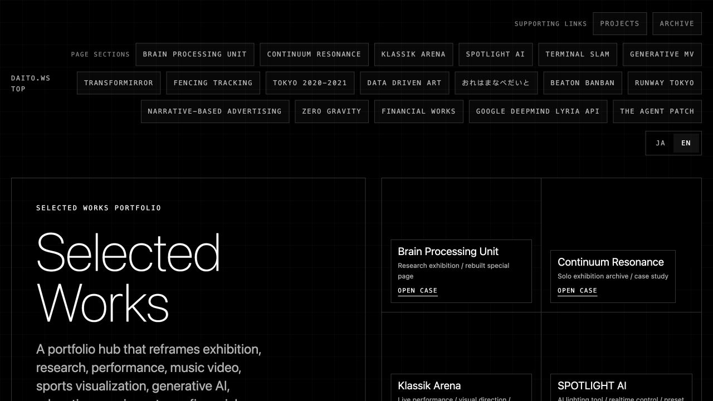

- 直接链接：[Selected Works](https://daito.ws/projects/selected-works/en/)
- 组织 / 设计语境：真锅大度本人作品网站；面向策展人、合作方、媒体与研究者的作品中枢。
- 页面类型：精选作品索引 + 专题案例入口。
- 布局 / 栅格：黑底工程制图式栅格；首屏以大标题和多列卡片形成左右不对称结构；顶端用密集标签作为快速跳转。
- 字体 / 层级：超大无衬线标题建立第一层级；等宽大写标签负责系统信息；正文为中性无衬线。
- 图像 / 顺序：索引以卡片进入不同项目；适合在后续详情页采用 16:9 主视觉、过程图、系统图与现场图交替。
- 导航 / 过滤 / 详情：页面区段标签、Projects / Archive、日英切换共同组成多入口导航。
- 阅读适配：适合短段落与技术摘要；若作为中文长文主结构，需要降低网格线密度并加宽正文行距。
- 可借鉴：**暗色主界面 + 精确网格 + 标签化作品中枢 + 双语切换**。
- 注意事项：不要把“黑底 + 细线 + 等宽字”当作真锅大度的唯一视觉符号；应保留档案可信度与可读性。

## B｜Rhizomatiks Research — Works

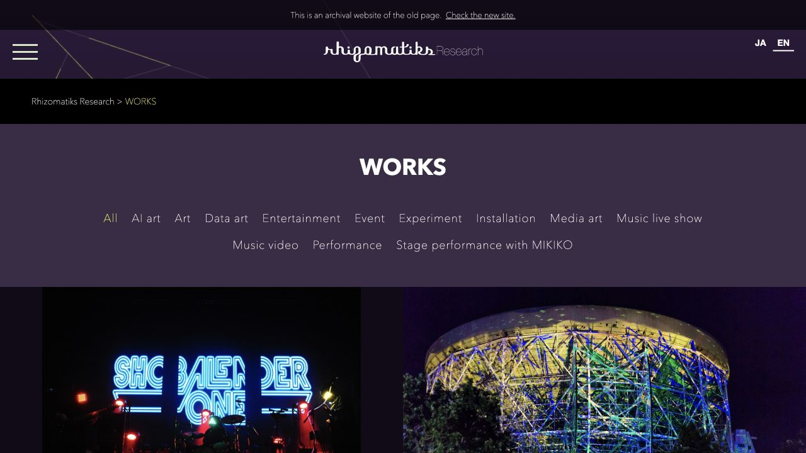

- 直接链接：[Works](https://research.rhizomatiks.com/en/works/)
- 组织 / 设计语境：Rhizomatiks Research 旧版档案；面向艺术、舞台、研究与商业合作的混合受众。
- 页面类型：工作室作品分类与视觉索引。
- 布局 / 栅格：深色背景、居中分类区、下接大幅图像网格；顶部品牌条稳定，作品图承担主要浏览动力。
- 字体 / 层级：品牌字标与细字正文形成“实验工作室”气质；分类标签权重接近，强调横向扫描。
- 图像 / 顺序：大比例、并排的现场图适合呈现灯光、舞台和装置尺度；可用于真锅作品的“视觉冲击段”。
- 导航 / 过滤 / 详情：以 AI art、Data art、Installation、Performance 等类别切换内容。
- 阅读适配：适合浏览，不适合连续长文；应把分类条作为辅助导航，而不是正文主体。
- 可借鉴：**媒介类型标签 + 大幅现场图网格 + 工作室项目的跨类别组织**。
- 注意事项：旧档案首屏留白较大；分类数量过多会让 21 件作品显得被切得过碎。

## C｜Ryoji Ikeda — Works Archive

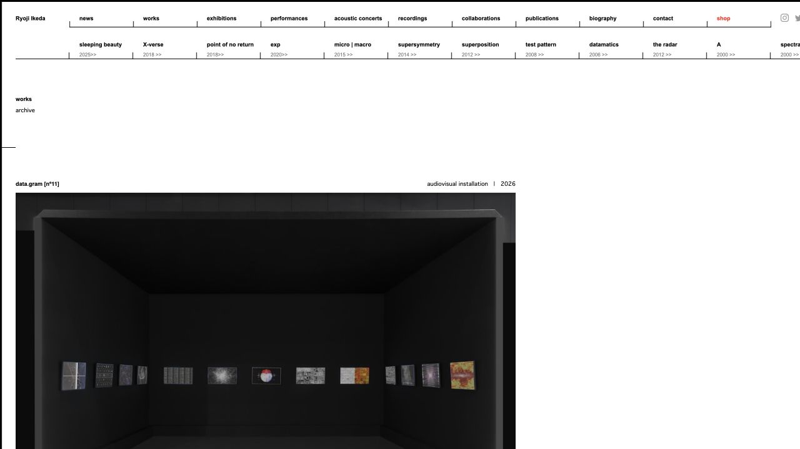

- 直接链接：[Works Archive](https://www.ryojiikeda.com/archive/works/)
- 组织 / 设计语境：池田亮司个人作品档案；与真锅同处数据、声光和计算美学语境。
- 页面类型：按项目系列与年代组织的技术型作品档案。
- 布局 / 栅格：白底、极细分隔线、顶部横向系列索引；正文将作品名、类型、年份和大图压进统一测量式栅格。
- 字体 / 层级：极小号无衬线文字，高密度但克制；标题并不夸张，作品图和参数共同主导页面。
- 图像 / 顺序：大图之后可连续承接材料、尺寸、日期、地点与协作人员，适合技术性强的作品。
- 导航 / 过滤 / 详情：系列与时间段在顶端持续可见，强化“作品谱系”而非单件展示。
- 阅读适配：适合参数与短注释；中文长文需显著放大字号，并将横向系列导航转为可折叠结构。
- 可借鉴：**年代 / 系列轴 + 技术参数表 + 图像与数据等权**。
- 注意事项：原站的小字号和宽横向导航不应直接移植到移动端。

## D｜NTT InterCommunication Center — MANABE Daito

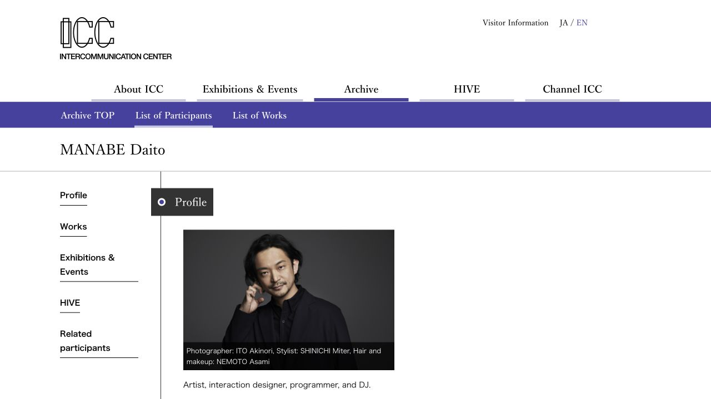

- 直接链接：[MANABE Daito](https://www.ntticc.or.jp/en/archive/participants/manabe-daito/)
- 组织 / 设计语境：NTT ICC 机构档案；把艺术家放进作品、展览、活动、影像和相关人物网络。
- 页面类型：机构级人物档案详情。
- 布局 / 栅格：机构主导航之下设置档案子导航；主体采用左侧分区目录 + 右侧内容栏。
- 字体 / 层级：机构标题使用衬线字，导航与正文使用无衬线；层级传统但清晰。
- 图像 / 顺序：先人物肖像和简介，再进入作品、展览与活动，适合建立研究可信度。
- 导航 / 过滤 / 详情：Profile、Works、Exhibitions & Events、HIVE、Related participants 是稳定的实体关系导航。
- 阅读适配：中文长文与参考文献兼容性很好，尤其适合“艺术家—作品—机构”叙述。
- 可借鉴：**左侧章节目录 + 实体关系 + 机构档案语气**。
- 注意事项：版式偏传统，若作为主参考，需要用作品图像与动态细节补足感官层。

## E｜Ars Electronica Archive

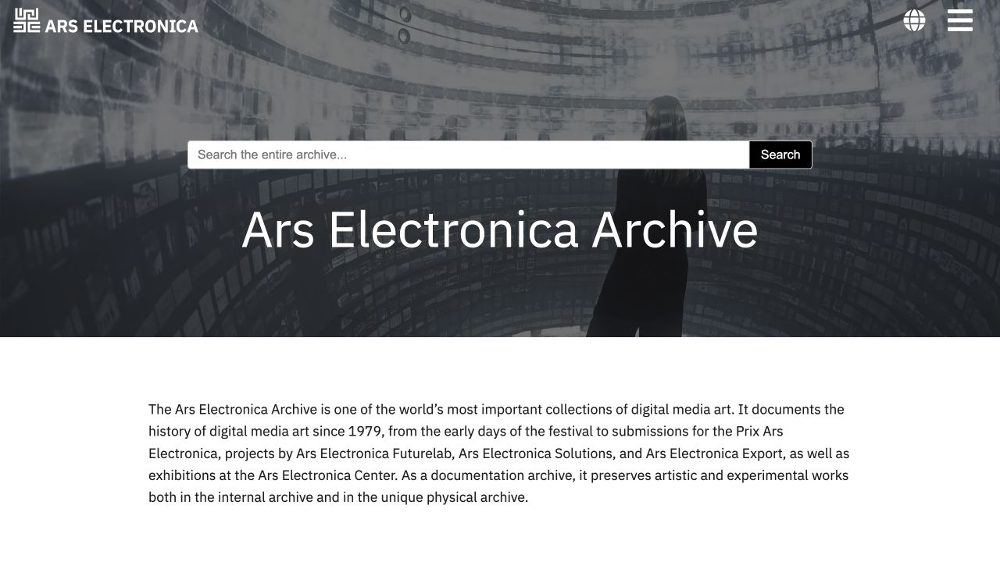

- 直接链接：[Ars Electronica Archive](https://ars.electronica.art/archive/en/)
- 组织 / 设计语境：自 1979 年延续至今的数字媒体艺术机构档案入口。
- 页面类型：跨项目、奖项、艺术家与历史材料的总档案。
- 布局 / 栅格：大幅背景图承载站点身份；搜索框置于首屏中央；下方用简洁段落说明档案范围。
- 字体 / 层级：高对比白字叠图；搜索框是第一交互层，标题是第一语义层。
- 图像 / 顺序：首屏用一张沉浸式环境图确立领域语境，后续再进入检索与分类。
- 导航 / 过滤 / 详情：全库搜索最突出，适合大量、跨年代内容。
- 阅读适配：说明文字清晰；若用于 21 件作品，搜索框应降级为次级工具。
- 可借鉴：**搜索优先 + 档案范围说明 + 媒体艺术现场图作为领域入口**。
- 注意事项：英雄图占据大量首屏，可能延迟用户看到艺术家与核心论点。

## F｜ZKM — Collection and Archives

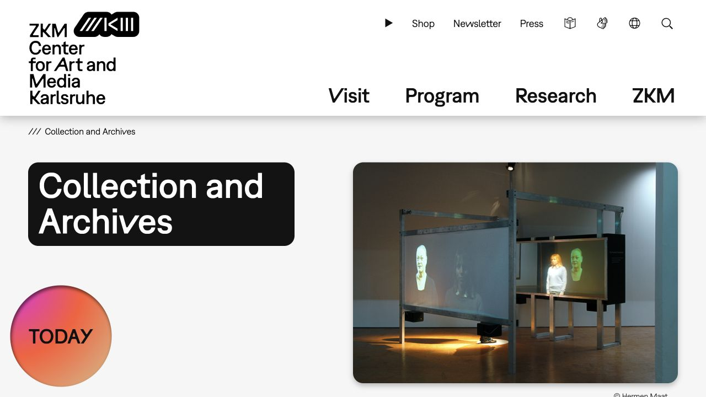

- 直接链接：[Collection and Archives](https://zkm.de/en/collection-and-archives)
- 组织 / 设计语境：ZKM 艺术与媒体中心；公共访问、研究与机构品牌并重。
- 页面类型：收藏与档案的模块化入口。
- 布局 / 栅格：粗体标题置于黑色圆角块；对侧为大幅作品图；辅助模块用几何色块。
- 字体 / 层级：超粗无衬线、高对比标题；机构名称本身形成垂直文字雕塑。
- 图像 / 顺序：标题与图像等面积对照，适合把章节引言和关键作品成对出现。
- 导航 / 过滤 / 详情：Visit、Program、Research、ZKM 等高层入口清晰，内部再分收藏与档案。
- 阅读适配：标题和章节入口强，正文需要另设更安静的阅读模板。
- 可借鉴：**大标题模块 + 关键作品图 + 章节入口的空间化构图**。
- 注意事项：圆角色块和强字标很容易抢走艺术家作品的注意力。

## G｜Rhizome ArtBase

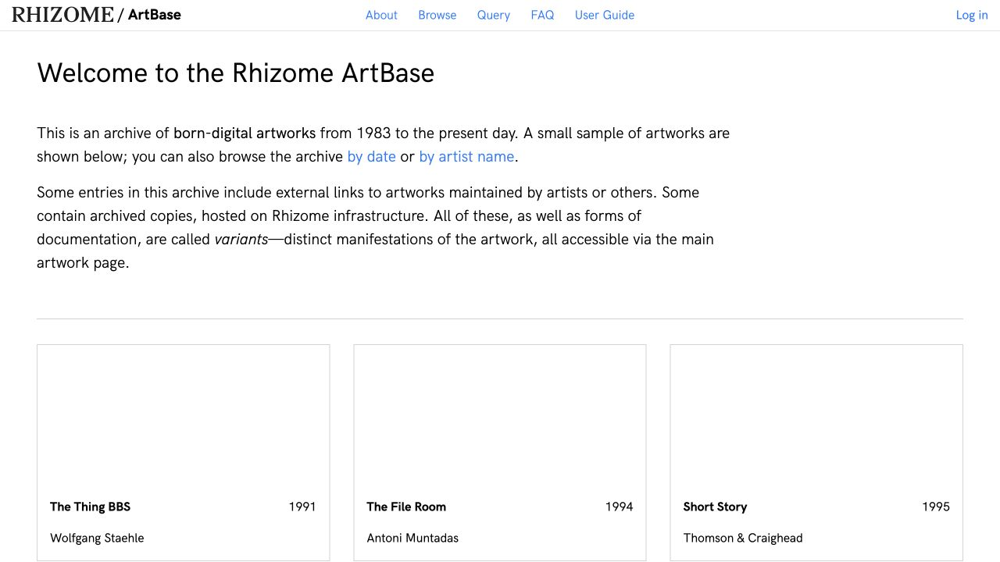

- 直接链接：[Rhizome ArtBase](https://artbase.rhizome.org/wiki/Main_Page)
- 组织 / 设计语境：面向 born-digital 作品的保存与访问档案。
- 页面类型：数字艺术保存数据库与使用说明。
- 布局 / 栅格：白底、窄页头、文本说明之后是规则三列卡片；结构接近研究工具。
- 字体 / 层级：正文优先，蓝色链接直接表达可访问行为；装饰很少。
- 图像 / 顺序：卡片包含作品、年份、艺术家；图像是索引线索，不压过保存信息。
- 导航 / 过滤 / 详情：About、Browse、Query、FAQ、User Guide 清楚分离“看作品”和“理解档案”。
- 阅读适配：非常适合来源说明、保存状态、外链和版本信息。
- 可借鉴：**作品版本 / 变体说明 + 访问状态 + 保存来源透明度**。
- 注意事项：作为主视觉会显得过于工具化；更适合承担来源和方法论模块。

## H｜M+ — Collection Online

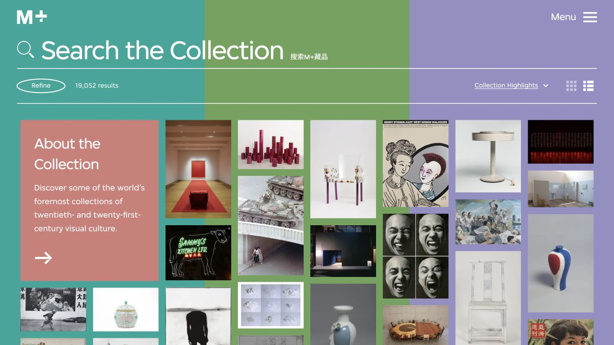

- 直接链接：[Collection Online](https://www.mplus.org.hk/en/collection/)
- 组织 / 设计语境：M+ 视觉文化收藏数据库；面向公众浏览与研究检索。
- 页面类型：可搜索、可筛选、可切换显示模式的大型馆藏。
- 布局 / 栅格：搜索栏横跨首屏；结果数与 Refine 紧随其后；下方使用多比例瀑布流图像。
- 字体 / 层级：超大搜索提示与极简控件；彩色背景分区让数据库浏览更具展览感。
- 图像 / 顺序：保留原作品横竖比例，不强迫统一裁切；视觉密度高，适合跨媒介作品。
- 导航 / 过滤 / 详情：搜索、筛选、结果数、精选排序、网格 / 列表切换构成完整检索闭环。
- 阅读适配：索引强、长文弱；详情页应切换为更窄的研究阅读布局。
- 可借鉴：**多比例作品墙 + 结果数 + 轻量筛选 + 网格 / 列表视图**。
- 注意事项：当前只有 21 件核心作品，不宜复制大型数据库的全部复杂度；可只保留媒介、年份与合作方三类筛选。

## I｜Tate — Discover Art

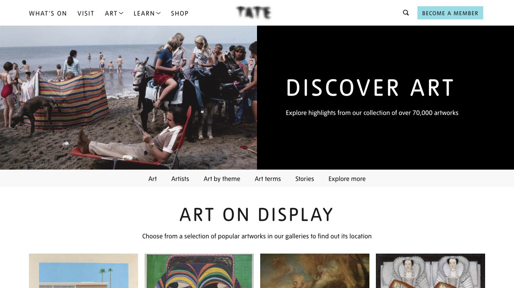

- 直接链接：[Discover Art](https://www.tate.org.uk/art)
- 组织 / 设计语境：Tate 馆藏浏览入口；兼顾大众教育、作品发现与主题内容。
- 页面类型：图像化艺术发现门户。
- 布局 / 栅格：首屏左右二分，一侧图像、一侧黑底标题；下方设置 Art、Artists、Theme、Terms、Stories 等主题锚点。
- 字体 / 层级：大写疏排标题建立展览感，正文用中性字体保证可读性。
- 图像 / 顺序：先用单张情境图建立情绪，再进入横向分类和多列作品卡。
- 导航 / 过滤 / 详情：从“发现”进入作品、艺术家、主题和术语，降低数据库的学习成本。
- 阅读适配：适合作为公众入口与知识导航；研究级参数需要其他参考补足。
- 可借鉴：**半屏图像 / 半屏命题 + 主题锚点 + 大众友好的发现路径**。
- 注意事项：若采用过多博物馆常规模块，会削弱真锅大度项目的实验性与作者性。

## J｜Wellcome Collection — Stories

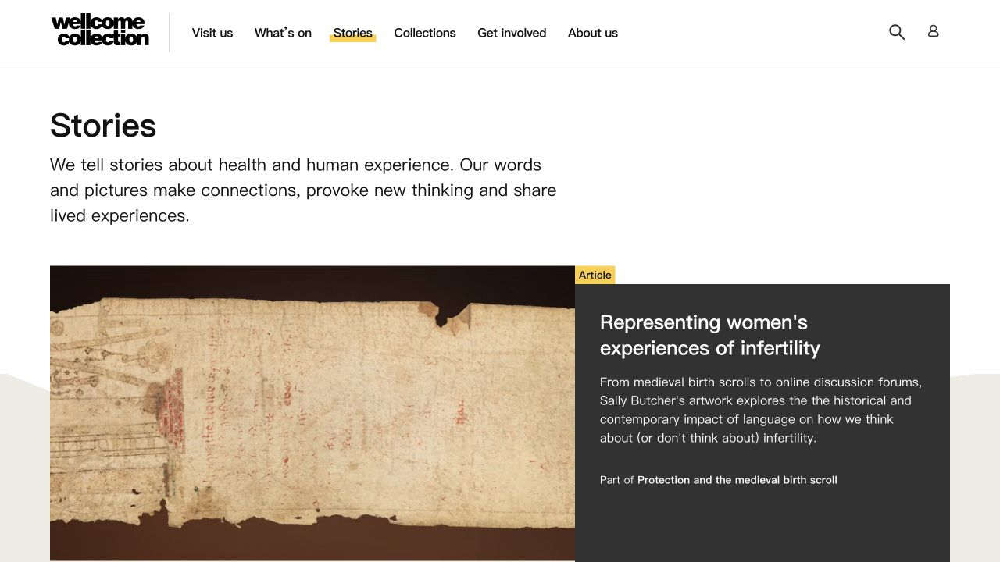

- 直接链接：[Stories](https://wellcomecollection.org/stories)
- 组织 / 设计语境：以健康与人类经验为主题的博物馆编辑内容；强调长文、图片故事、短片与多种媒介。
- 页面类型：编辑型故事首页与长篇内容入口。
- 布局 / 栅格：页面标题与一句清晰使命陈述在首屏上方；主推荐采用大图 + 深色文字卡的双栏结构。
- 字体 / 层级：标题巨大但行长受控；黄色内容类型标签让文章、长读、图集、短片快速可辨。
- 图像 / 顺序：主图与摘要同步出现，适合把作品图像、论点和阅读承诺绑定。
- 导航 / 过滤 / 详情：按主题与内容类型组织，不强调复杂筛选。
- 阅读适配：对中文长文、章节导语、引文、图注与脚注最友好。
- 可借鉴：**长文导语 + 内容类型标签 + 主图 / 摘要分栏 + 舒适正文宽度**。
- 注意事项：编辑叙事强、作品数据库弱，应作为阅读模板辅助参考。

## K｜CERN Scientific Information Service — Web Archives

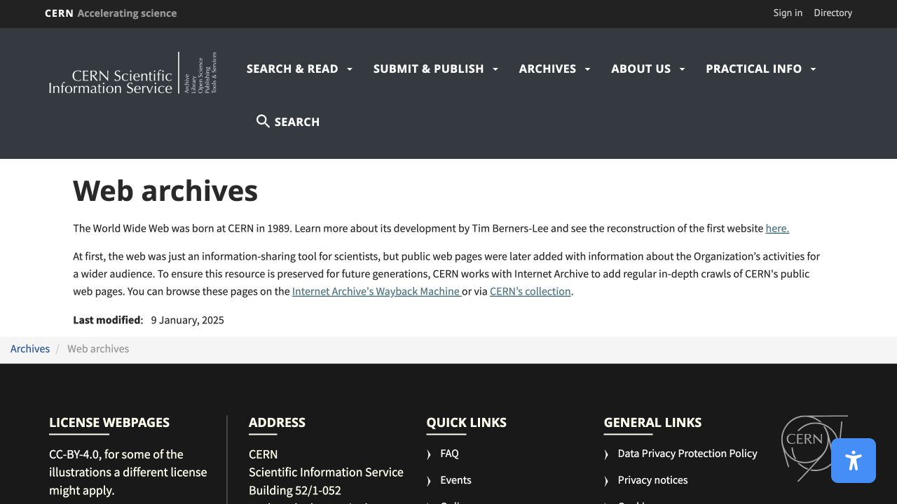

- 直接链接：[Web Archives](https://sis.web.cern.ch/archives/web_archives)
- 组织 / 设计语境：CERN 科学信息服务的网页保存说明；面向研究者与公众。
- 页面类型：科学机构档案说明与外部保存入口。
- 布局 / 栅格：深色机构页头 + 白底正文；单列说明后明确列出面包屑、更新时间和页脚责任信息。
- 字体 / 层级：常规无衬线，标题、正文、链接和元数据区分稳定。
- 图像 / 顺序：几乎不依赖图像，强调文字证据、保存责任和可追溯访问。
- 导航 / 过滤 / 详情：Search & Read、Submit & Publish、Archives、About Us 构成研究生命周期。
- 阅读适配：来源、方法、更新时间与引用说明非常清楚。
- 可借鉴：**更新时间 + 档案方法 + 引用 / 外链 + 责任归属**。
- 注意事项：不适合作为主视觉；最适合补足研究透明度和“关于本档案”页面。

---

## 四种可行的主参考取向

这不是最终视觉方向，只是帮助选择 Stage 5 主参考：

1. **A｜艺术家原生 / 工程感**：最贴近真锅大度当下网站语言，强作者性，适合做暗色实验档案。
2. **D｜机构研究 / 案例档案**：可读性和实体关系最稳，适合毕业设计研究呈现。
3. **H｜可搜索馆藏 / 数据浏览**：把 21 件作品变成可探索的数据集合，交互潜力最大。
4. **J｜编辑长文 / 叙事阅读**：最能承载现有案例研究和叙事脚本，适合“作品驱动的数字专著”。

辅助参考可从以下功能中选择：

- 时间轴与技术元数据：C
- 媒介分类与现场图网格：B
- 搜索和档案范围说明：E
- 章节入口与大标题模块：F
- 保存状态、来源和版本：G
- 主题发现路径：I
- 更新时间与研究透明度：K

## 选择检查点

请选：

- **主参考：1 个编号**
- **辅助参考：2–3 个编号**
- 每个辅助参考可注明希望借鉴的功能，例如“筛选”“技术参数”“长文排版”“图像比例”“档案来源”

收到选择后，Stage 6 才会使用现有真锅大度真实内容生成 **2–3 个差异明显的视觉方向**，并再次等待你确认后才进入响应式原型。
