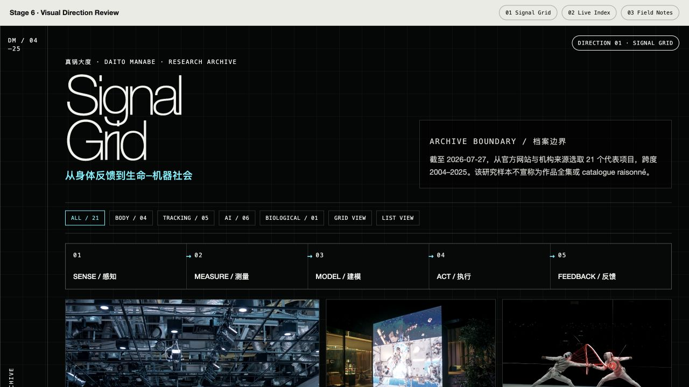
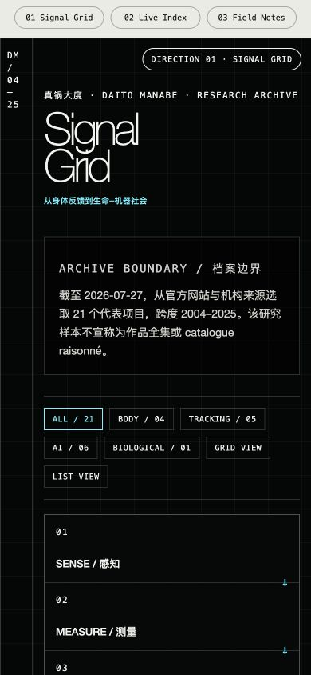
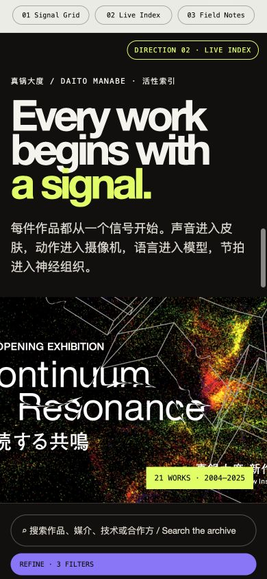
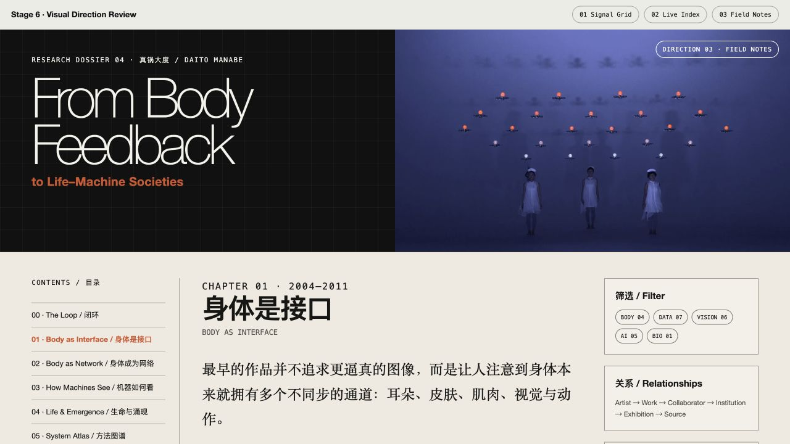
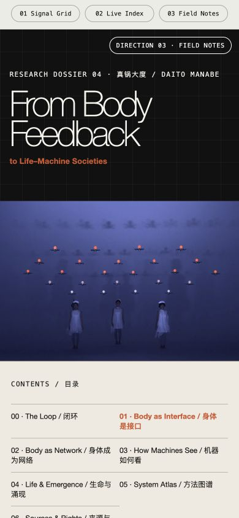

# 真锅大度研究档案｜Stage 6 视觉方向比较

> 已批准参考：A 为主参考；D、H、J 为辅助参考  
> 检查日期：2026-07-27  
> 当前状态：等待选择 1 个方向；尚未进入最终响应式原型

## 已批准的参考如何进入方向

- **A｜Daito Manabe Selected Works**：三套方向共同使用暗色系统外壳、精确栅格、双语层级和标签化作品入口。
- **D｜NTT ICC 人物档案**：加入 Artist → Work → Collaborator → Institution → Exhibition → Source 的机构关系。
- **H｜M+ Collection Online**：加入结果数、轻量筛选、网格 / 列表切换和多比例作品图像。
- **J｜Wellcome Collection Stories**：加入章节导语、长文阅读宽度、图文分栏、内容类型标签。

完整可滚动评审页：[打开三套视觉方向](./index.html)

---

## 方向 01｜Signal Grid / 信号网格

### 核心概念

把真锅大度的研究档案视为一台可以读取的信号仪器。栅格、坐标、编号、信号闭环与技术参数共同组织作品。

### 页面特征

- 黑底工程网格贯穿页面；
- 超大英文标题与较小中文命题形成双语层级；
- `SENSE → MEASURE → MODEL → ACT → FEEDBACK` 作为关系视图；
- 作品卡等权显示图像、年份、媒介、技术、机制和信用；
- 年表压缩为横向数据带；
- 筛选与网格 / 列表切换直接暴露在作品入口上方。

### 权衡

- 信息密度：**高**
- 长文舒适度：**中**
- 图像强调：**中**
- 技术风险：**低**，主要由规则栅格和常规卡片构成
- Figma 可转移性：**高**
- 最适合：方法图谱、技术分析、展陈屏幕、研究数据库
- 风险：如果细线、编号和等宽文字使用过量，中文阅读会显得紧张

---

## 方向 02｜Live Index / 活性索引

### 核心概念

把档案理解为一个不断活化的作品图像场。用户先被现场图和作品差异吸引，再通过搜索、筛选和关系节点进入研究信息。

### 页面特征

- 黑色背景和高冲击标题保留 A 的作者性；
- 酸性绿色与紫色只作为选择和分类状态；
- 采用 H 式多比例作品墙，不统一裁切横幅、现场图与互动影像；
- 搜索、结果数、Refine 和显示模式成为主要入口；
- 关系节点以 BODY、CAMERA、MODEL、IMAGE、AUDIENCE 动态组织；
- 长篇内容被放到作品墙之后，作为二级阅读层。

### 权衡

- 信息密度：**中**
- 长文舒适度：**中**
- 图像强调：**很高**
- 技术风险：**中—高**，多比例布局和筛选状态需要更细致的响应式处理
- Figma 可转移性：**中**
- 最适合：公共展示、作品发现、视觉化馆藏、互动装置入口
- 风险：强图像和高饱和状态色可能让研究来源与长文退居次位

---

## 方向 03｜Field Notes / 场域札记

### 核心概念

用暗色系统外壳包裹一份可连续阅读的数字研究专著：首屏保留真锅大度的技术性，正文转入温暖纸色、章节目录和证据侧栏。

### 页面特征

- 暗色首屏维持 A 的系统气质，正文切换为浅色阅读区；
- J 式章节导语、长文列宽、引文和案例段落；
- D 式章节目录、实体关系与来源证据侧栏；
- H 式轻量筛选缩减为 BODY、DATA、VISION、AI、BIO 五类；
- 正文案例将机制、技术材料、来源、信用和权利状态放在同一阅读节奏里；
- 适合把现有《案例研究》和《内容结构与叙事脚本》直接转为网站章节。

### 权衡

- 信息密度：**中—低**
- 长文舒适度：**很高**
- 图像强调：**中**
- 技术风险：**低**
- Figma 可转移性：**高**
- 最适合：毕业设计答辩、研究阅读、案例专著、来源审查
- 风险：如果浅色正文比例过大，可能削弱作品现场的沉浸感和实时系统感

---

## 并排比较

| 维度 | 01 Signal Grid | 02 Live Index | 03 Field Notes |
|---|---|---|---|
| 第一印象 | 精密、技术、系统化 | 活跃、沉浸、图像驱动 | 理性、编辑化、研究导向 |
| A 主参考权重 | 很高 | 高 | 中（集中在外壳） |
| D 机构关系 | 中 | 中 | 很高 |
| H 筛选与作品墙 | 中 | 很高 | 低—中 |
| J 长文阅读 | 中 | 中 | 很高 |
| 作品图像 | 卡片式 | 多比例瀑布流 | 章节主图与案例图 |
| 时间结构 | 数据带年表 | 浏览后进入年表 | 章节与侧栏年表 |
| 中文连续阅读 | 可用但偏紧 | 适合短文 | 最舒适 |
| 响应式复杂度 | 低 | 最高 | 低—中 |
| 后续交互潜力 | 信号闭环、参数切换 | 搜索、筛选、关系探索 | 章节定位、注释、证据展开 |

## 选择检查点

请从以下三项中选择一个：

- `01 Signal Grid`
- `02 Live Index`
- `03 Field Notes`

也可以选择组合，例如：`以 03 为主，保留 01 的信号闭环和 02 的多比例作品墙`。

选择后才会进入 Stage 7，把方向转换为可运行、可筛选、可切换中英文的响应式原型，并把最终网格、字号、颜色、间距、图像比例和移动端规则写入 `decisions.json`。
